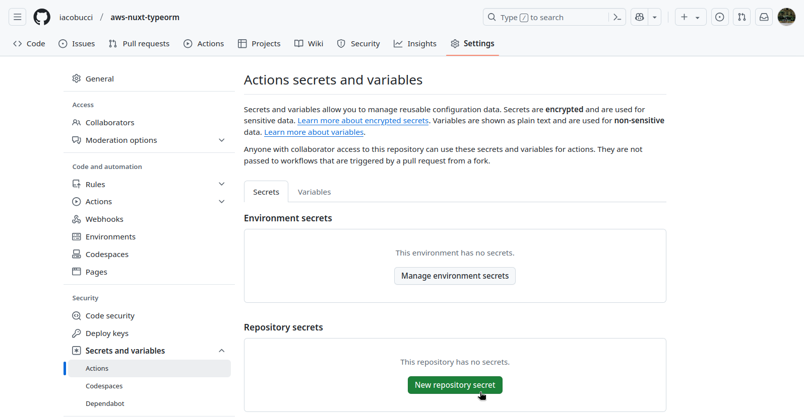

# Cfn Nuxt Typeorm Lambda and Aurora

## Modalità di sviluppo

Avviare il database postgres per lo sviluppo.

```bash
cd postgres
docker build -t postgres_dev .
docker run -d --name postgres_dev -p 5432:5432 postgres_dev
```

Avviare il server Nuxt.

```bash
npm install
npx nuxi dev
```

## Creazione dell'infrastruttura AWS

Configurare le credenziali AWS dopo l'installazione della CLI.

```
aws configure
```

Poi creare nella dashboard un ruolo IAM con i permessi completi

Impostare i secrets di github actions:



| nome secret           | valore |
| --------------------- | ------ |
| AWS_ACCESS_KEY_ID     | \*\*\* |
| AWS_ACCESS_KEY_SECRET | \*\*\* |
| DB_PORT               | \*\*\* |
| DB_NAME               | \*\*\* |
| DB_USERNAME           | \*\*\* |
| DB_PASSWORD           | \*\*\* |

Fare un push su master.
